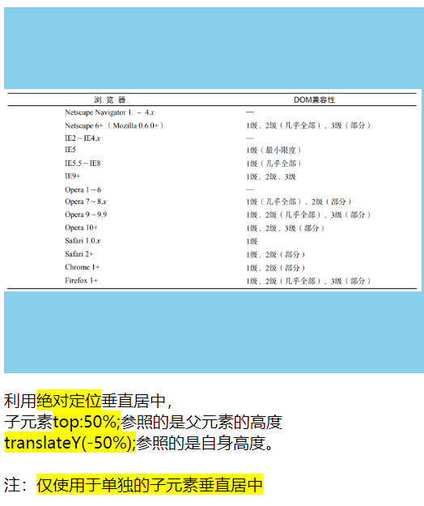

"# practicalProjects" 

JavaScript study notebook

# 五种垂直居中

- 利用inline元素，[案例](./verticalMiddle/inlineBlock.html)
    
- 利用绝对定位，[案例](./verticalMiddle/absolutMiddle.html)
    
- 利用table，[案例](./verticalMiddle/tableMiddle.html)
    
    
- 利用line-height，[案例](./verticalMiddle/lineHeightMiddle.html)
    
- 利用flex，[案例](./verticalMiddle/flexMiddle.html)
    